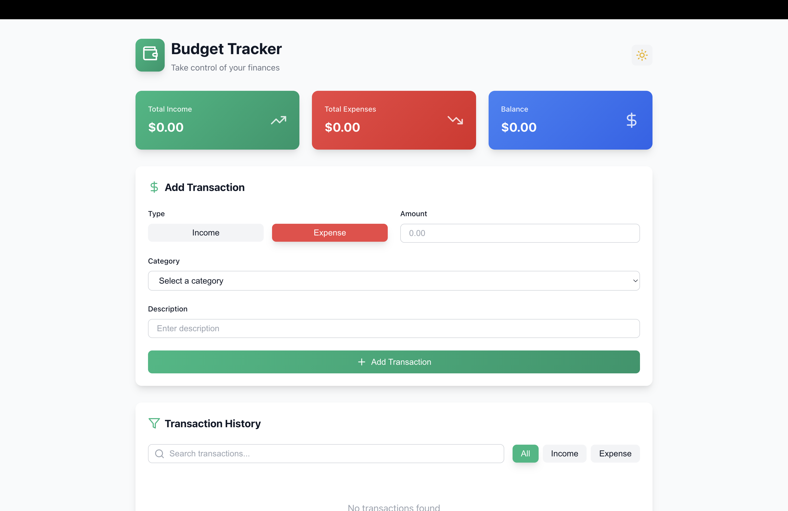

# 🧾 Budget Tracker

A fully responsive, modern **Budget Tracker** built with **React (TypeScript)**, **JavaScript**, **HTML**, and **CSS**. Track your income, expenses, and overall balance with ease using a clean, user-friendly interface.

------------------

### 🌐 Live Demo  
👉 [Click here to view the live project](https://budget-tracker-virid-gamma.vercel.app/)

📁 [View the Code on GitHub](https://github.com/Aryan-jr-07/Budget_Tracker.git)

------------------

### 🚀 Features

- 📊 Track Total Income, Expenses & Balance  
- ➕ Add & categorize transactions (Income or Expense)  
- 🔍 Search & filter through your transaction history  
- ☀️🌙 Light/Dark mode toggle  
- ✅ Clean and fully responsive UI  
- 💾 Optional data persistence with `localStorage`

------------------

### 🛠️ Tech Stack

- **Frontend:** React + TypeScript  
- **Styling:** HTML, CSS (optionally Tailwind)  
- **State Management:** React Hooks (`useState`, `useEffect`)  
- **Tooling:** Vite, npm

------------------

### 📁 Folder Structure
src/
├── components/        # Reusable UI components
├── contexts/          # Theme or global context
├── hooks/             # Custom React hooks
├── utils/             # Utility functions
├── App.tsx            # Main app logic
├── main.tsx           # React root entry point

------------------

### 🧪 Run Locally

# Clone the repository
git clone https://github.com/Aryan-jr-07/Budget_Tracker.git

# Navigate to the project directory
cd Budget_Tracker

# Install dependencies
npm install

# Start the Vite development server
npm run dev

------------------

📦 Future Enhancements
	•	📈 Add charts (category-wise expenses/income)
	•	🗃️ Export transactions to CSV
	•	🔐 User login and cloud sync (e.g., Firebase)
	•	📱 Convert to a PWA for offline access
 
